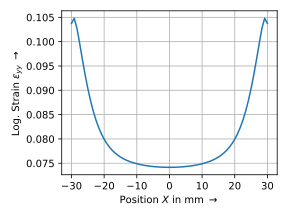
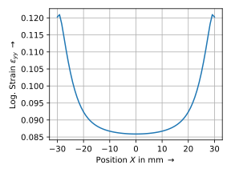

<p align="center">
  <a href="https://felupe.readthedocs.io/en/latest/?badge=latest"></a>
  <p align="center"><b>Fiber-Reinforced-Rubber</b></p>
  <p align="center"><em>Numeric simulation of a test specimen with a fiber-reinforced rubber composite.</em></p>
</p>

This repository provides the reproducible simulation data performed in the paper submitted to ... . If you use this code in your scientific work, please cite it as:

...

# Installation
Install [Python](https://www.python.org/downloads/) (3.7 - 3.10), open a terminal and install the requirements.

```
pip install felupe[all] matadi matplotlib pypardiso termtables
```

# Usage
Edit and run the scripts `script_test-specimen-simulation.py` and `script_test-specimen-strain.py`.

# Results
The script generates deformed views on the test specimen and the force-displacement characteristic curves of the test specimen. Results are stored in [results/](results/).

## Deformed Views


## Force-displacement characteristic curves


## Strain distribution

The strain distribution of $\varepsilon_{yy}$ is evaluated at an applied tension of $Y=6$ mm



and at $Y=7$ mm.


