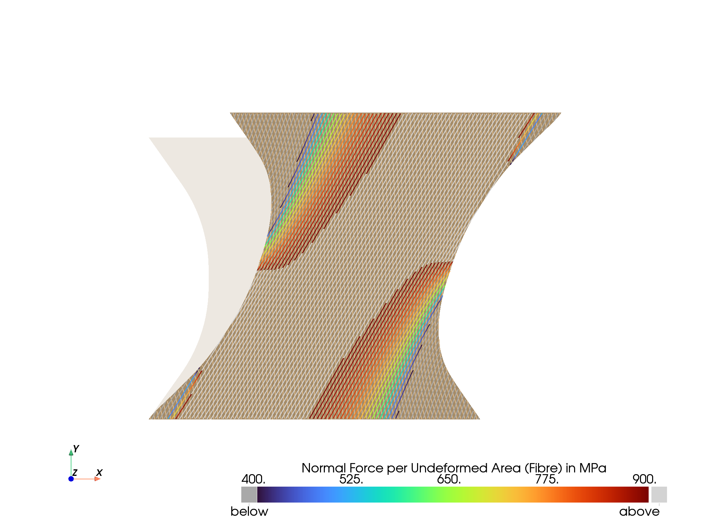
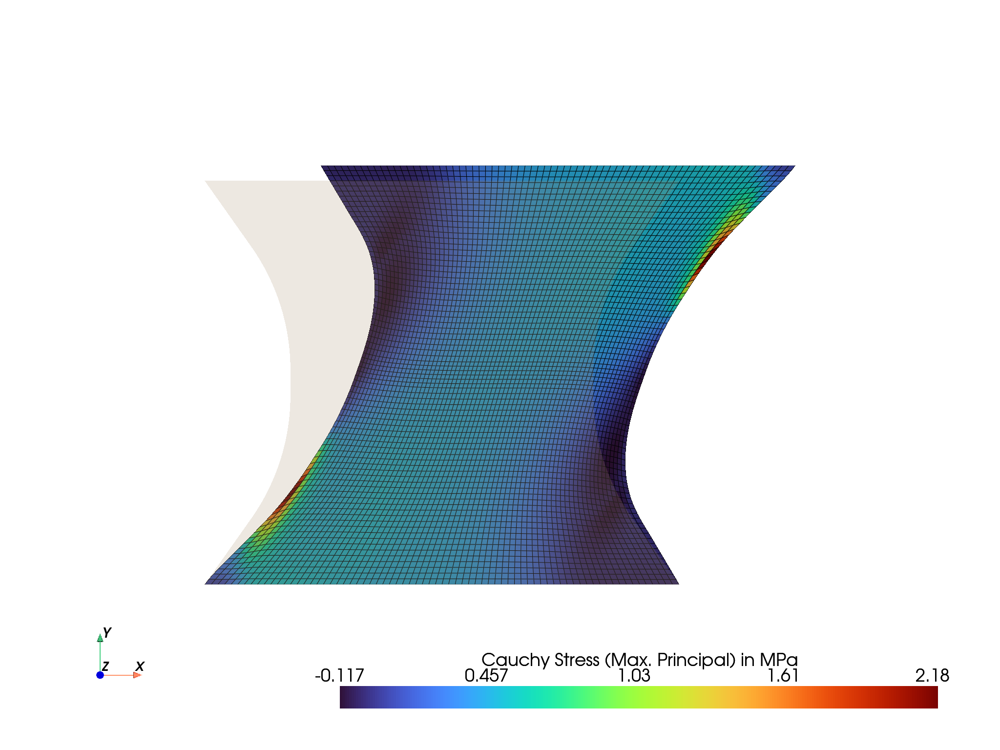
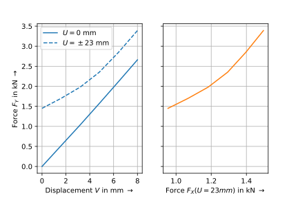

<p align="center">
  <a href="https://felupe.readthedocs.io/en/latest/?badge=latest"></a>
  <p align="center"><b>Fiber-Reinforced-Rubber</b></p>
  <p align="center">Numeric simulation for a test specimen with a fiber-reinforced rubber composite.</p>
</p>

This repository provides the reproducible simulation data performed in the paper submitted to ... . If you use this code in your scientific work, please cite it as:

...

# Installation
Install Python (3.7 - 3.10), open a terminal and install the requirements

```
pip install felupe[all] matadi matplotlib pypardiso
```

# Usage
Edit and run `script_test-specimen-simulation.py`.

# Results
The script generates deformed views on the test specimen and the force-displacement characteristic curves of the test specimen.






