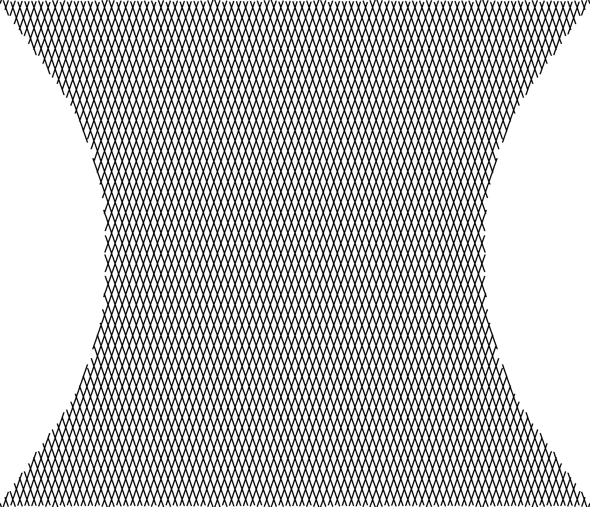
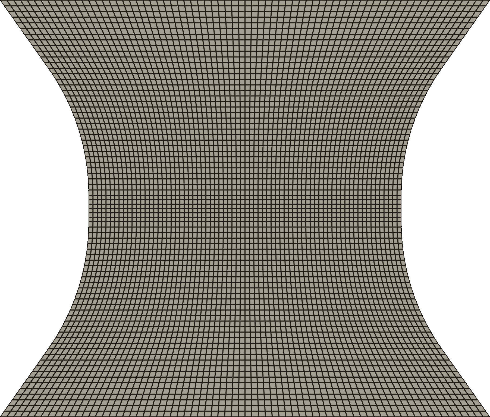
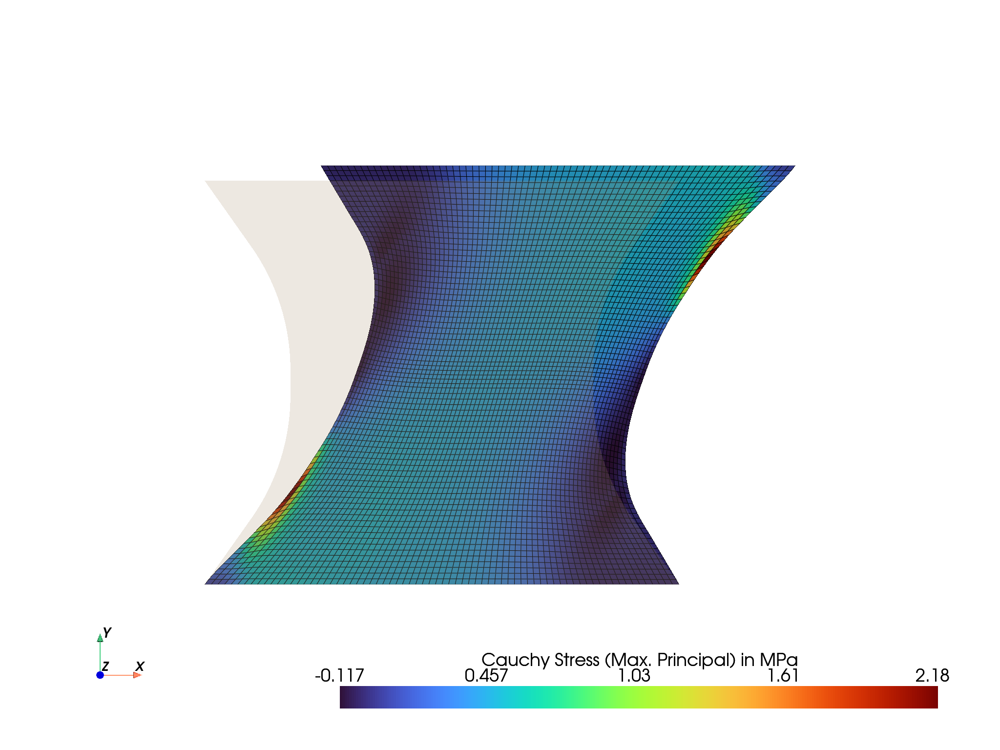
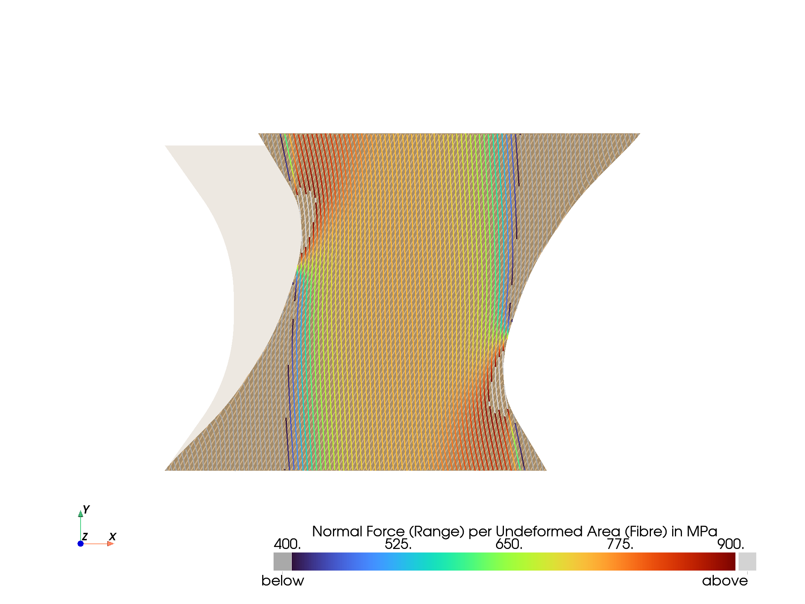
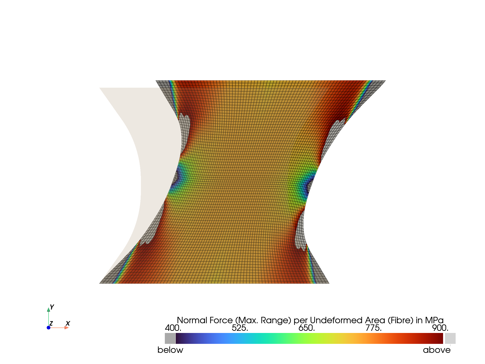
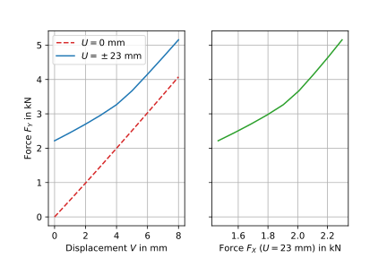
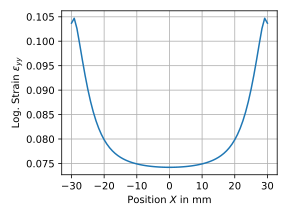
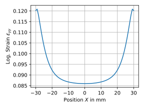

<p align="center">
  <a href="https://felupe.readthedocs.io/en/latest/?badge=latest"></a>
  <p align="center"></p>
  <p align="center"><b>Fiber-Reinforced-Rubber</b></p>
  <p align="center"><em>Numeric simulation of a test specimen with a fiber-reinforced rubber composite.</em></p>
</p>

[](https://opensource.org/license/mit/) [](https://codecov.io/gh/adtzlr/fiberreinforcedrubber) [](https://doi.org/10.1007/s10443-023-10157-1) 

This repository provides the reproducible simulation data of the paper

> 📘 Torggler, J., Dutzler, A., Oberdorfer, B., Faethe, T., Müller, H., Buzzi, C., & Leitner, M. (2023). **Investigating Damage Mechanisms in Cord-Rubber Composite Air Spring Bellows of Rail Vehicles and Representative Specimen Design. In Applied Composite Materials**. Springer Science and Business Media LLC. [](https://doi.org/10.1007/s10443-023-10157-1)

(also including a few extras).

# Installation
Install [Python](https://www.python.org/downloads/) 3.8+, [download](https://github.com/adtzlr/fiberreinforcedrubber/archive/refs/heads/main.zip) or clone this repository, open a terminal and install the package along with its dependencies.

```
pip install .
```

# Usage
Edit and run the scripts in the tests folder [`test_specimen_simulation.py`](tests/test_specimen_simulation.py) and [`test_specimen_strain.py`](tests/test_specimen_strain.py). Additionally, some more normal fiber force views on the test specimens are provided by [`test_specimen_amplitudes.py`](tests/test_specimen_amplitudes.py) and [`test_specimen_amplitudes_max_diff.py`](tests/test_specimen_amplitudes_max_diff.py) .

# Results
The scripts generate undeformed and deformed views on the test specimen, force-displacement characteristic curves of the test specimen as well as plots of the strain distribution. Results are stored in [docs/images/](docs/images/).

## Undeformed Views
The views on the undeformed test specimen show the quad mesh for the rubber and the (helper) meshes for the fibers.

<p align="center">
      
</p>

## Deformed Views
The views on the deformed test specimen are carried out for $F_Z=3$ kN ($V=7$ mm) at $U=23$ mm.

First, the fiber normal forces per undeformed area are shown (for each fiber family).


Next, the max. principal values of the Cauchy stress of the rubber matrix are shown.



The absolute force difference between the two fiber families is plotted on the quad-mesh.


For a cycle of $U=\pm23$ mm (at $F_Z=3$ kN) the normal force ranges (double amplitudes) of the fiber families are plotted:

a) separated for each fiber family




b) the maximum value, taking both fiber families into account



## Force-displacement characteristic curves



[Table of Force-Displacement Data](docs/images/test_specimen_forces_vs_displacement.md) [(csv)](docs/images/test_specimen_forces_vs_displacement.csv)

## Strain distribution

The strain distribution of $\varepsilon_{yy}$ is evaluated at an applied tension of $V=6$ mm



and of $V=7$ mm, both located in the middle of the height of the test specimen (at $Y=0$).



[Table of Strain Distribution (6 mm)](docs/images/LogStrainYY_V=6mm.md) [(csv)](docs/images/LogStrainYY_V=6mm.csv)

[Table of Strain Distribution (7 mm)](docs/images/LogStrainYY_V=7mm.md) [(csv)](docs/images/LogStrainYY_V=7mm.csv)

